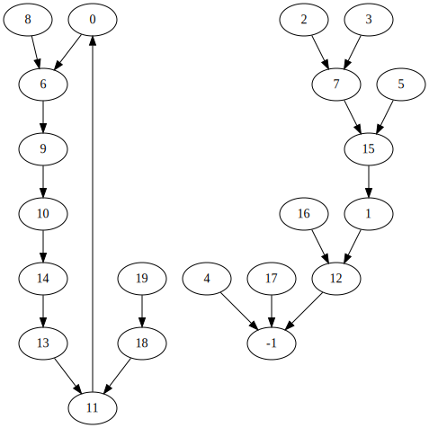
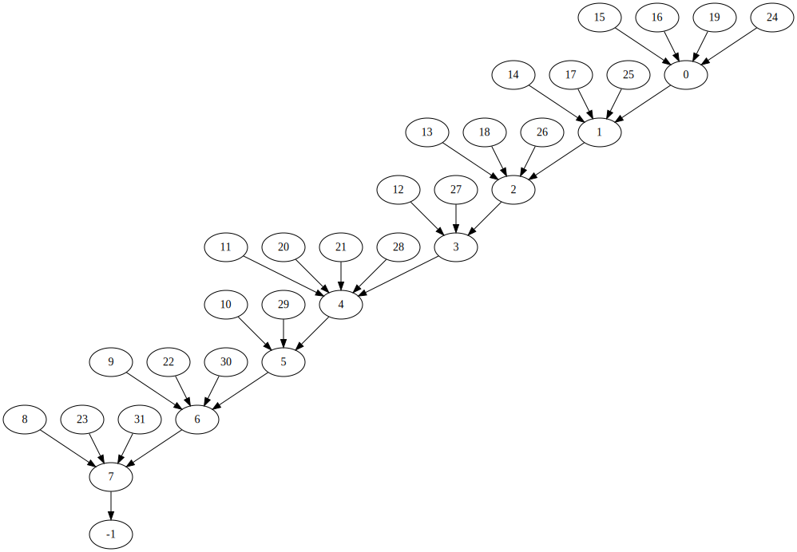
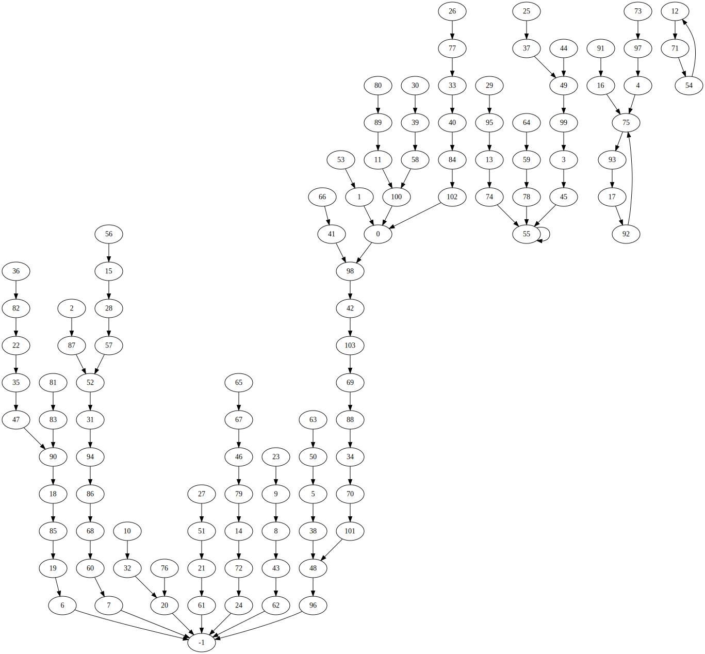
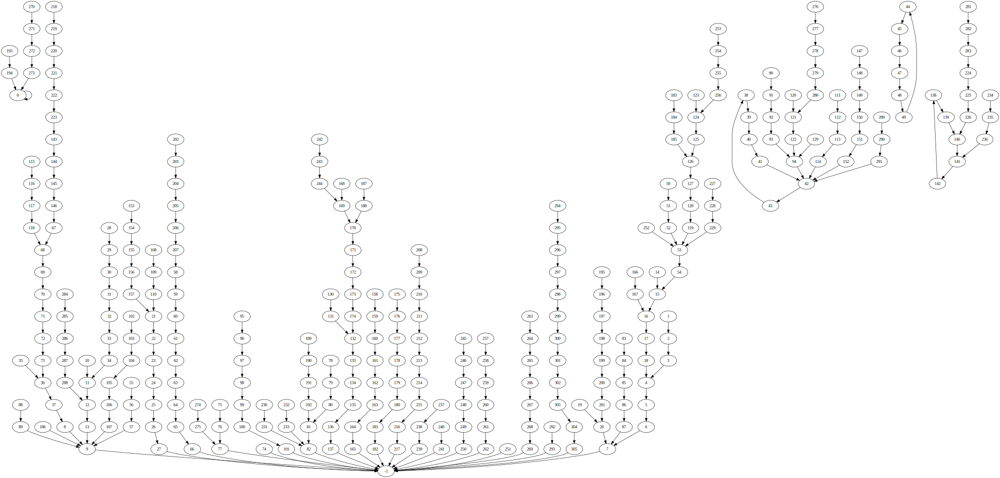

# fatsim

starter code for assignment 5

Testing:

## `test1.txt`


```
$ cat test1.txt
  6 12  7  7 -1 15  9 15  6 10
 14  0 -1 11 13  1 12 -1 11 18

$ ./fatsim < test1.txt
chain sizes: 1 1 5
elapsed time: 0.000s
```

## `test2.txt`


```
$ cat test2.txt
1 2 3 4 5 6 7 -1
7 6 5 4 3 2 1 0
0 1 2 0 4 4 6 7
0 1 2 3 4 5 6 7


$ ./fatsim < test2.txt
blocks in largest file: 9
blocks not in any file: 0
elapsed time:           0.000
```

```
$ ./fatsim < test3.txt
blocks in largest file: 0
blocks not in any file: 1000000
elapsed time:           0.006
```

```
$ ./fatsim < test4.txt
blocks in largest file: 17
blocks not in any file: 27
elapsed time:           0.000

cat test4.txt
  98    0   87   45   75   38   -1   -1   43    8
  32  100   71   74   72   28   75   92   85    6
  -1   61   35    9   -1   37   77   51   57   95
  39   94   20   40   70   47   82   49   48   58
  84   98  103   62   49   55   79   90   96   99
   5   21   31    1   12   55   15   52  100   78
   7   -1   -1   50   59   67   41   46   60   88
 101   54   24   97   55   93   20   33   55   14
  89   83   22   90  102   19   68   52   34   11
  18   16   75   17   86   13   -1    4   42    3
   0   48    0   69
```


```
$ ./fatsim < test5.txt
blocks in largest file: 21
blocks not in any file: 60
elapsed time:           0.000
```


```
]$ ./fatsim < test6.txt
blocks in largest file: 272
blocks not in any file: 4928
elapsed time:           0.000
```

```
$ ./fatsim < test7.txt
blocks in largest file: 26499
blocks not in any file: 196674
elapsed time:           0.084
```
